# SOLECTRUS Cloudflare Tunnel

## Was ist ein Cloudflare Tunnel?
[Cloudflare](https://www.cloudflare.com/) stellt mit dem Dienst Zero Trust eine Möglichkeit bereit, einen HTTP(S) Dienst über das Internet erreichbar zu machen, ohne einen Port am Router zu öffnen bzw. eine Weiterleitung einzurichten. Das funktioniert, indem der Dienst bzw. Server, auf dem der Dienst, läuft einen verschlüsselten Tunnel zu Cloudflare aufbaut. Bei Cloudflare wird der Tunnel dann auf eine (Sub-)Domain konnektiert. Der Dienst kann somit aus dem Internet über die URL aufgerufen werden.

## Sicherheit
Durch den Tunnel ist das interne Netzwerk bereits geschützt. Es besteht nur der Zugriff über ein bestimmtes Protokoll (HTTP) direkt auf den Server.

Weiterhin ist es möglich, für die URL Richtlinien festzulegen. Bspw. kann auf Länder eingeschränkt werden oder auch nur der Zugriff für eine bestimmte E-Mail Adresse erlaubt werden, vergleichbar mit einer 2FA-Anmeldung (2. Faktor). Kombinationen und weitere Einschränkungen sind möglich.

Ein Cloudflare Tunnel ist damit eine sicherere Variante im Vergleich zu dynDNS in der Fritz-Box.

## Voraussetzungen
1. Registrierte Domain
2. Cloudflare Account
3. Domain mit Cloudflare konnektiert (DNS)

> Die Registrierung einer Domain und Einrichtung/Konnektierung mit Cloudflare sind nicht Gegenstand dieser Anleitung.

## Cloudflare Tunnel einrichten

Cloudflare aufrufen und einloggen, im Menü "<b>Zero Trust</b>" anwählen. Alternativ kann man auch direkt das [Cloudflare One Dashboard](https://one.dash.cloudflare.com/) für Zero Trust aufrufen.

### Tunnel einrichten

1. Im Menü <b>Networks -> Connectors</b> anwählen
2. Mit dem Button "<b>+ Tunnel erstellen</b>" klicken.

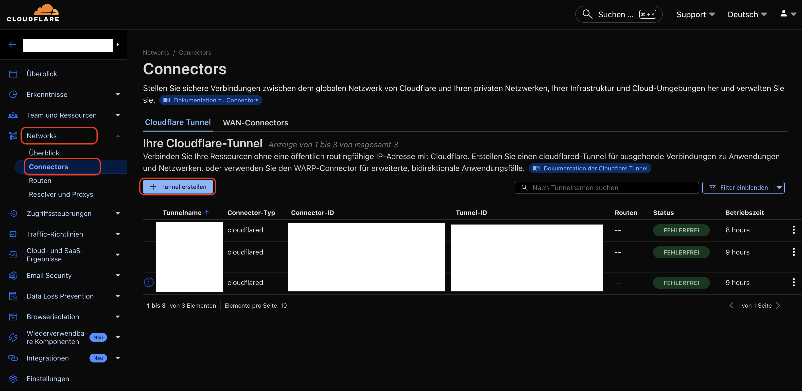

3. <b>Cloudflared</b> auswählen

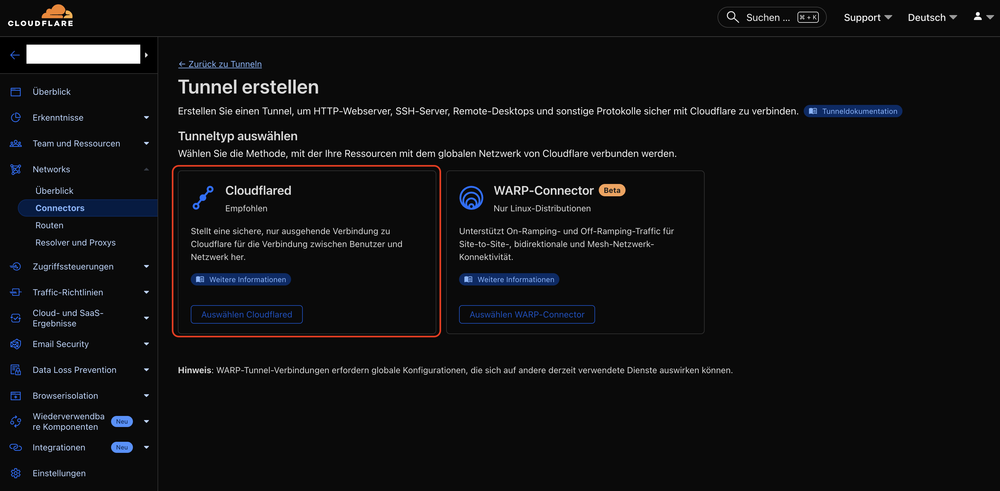

4. Sprechenden Namen vergeben, bspw. `SOLECTRUS Tunnel`
5. "<b>Tunnel speichern</b>"


6. Nun am besten die Schaltfläche "Docker" anwählen und den Befehl kopieren. Hier ist nur der Teil mit dem Token relevant. Der Befehl muss nicht auf dem SOLECTRUS Server ausgeführt werden.
7. Die Schaltfläche "<b>Weiter</b> anklicken

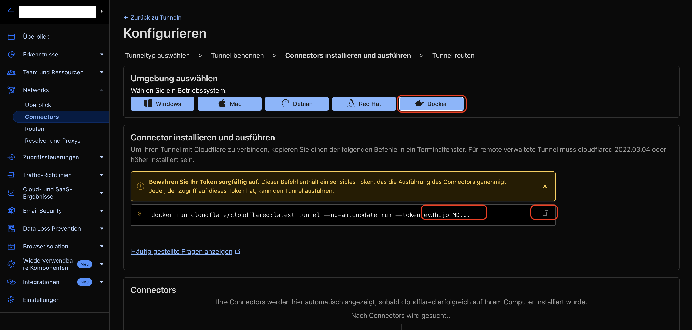

8. <b>Subdomain</b> befüllen, bspw. `strombilanz`
9. <b>Domäne</b> auswählen, hier ist nur die konnektierte Domain anwählbar
10. Bei <b>Dienst</b> `HTTP` anwählen
11. Bei <b>URL</b> `<IP>:<Port>` eingeben

> `<IP>` ist die interne IP des SOLECTRUS Servers, bspw. `192.168.2.8`. In vielen Anleitungen findet man die Info, dass hier auch `localhost` möglich ist. Das kann funktionieren, geht aber i.d.R. bei Docker-Stacks nicht.
> `<Port>` ist der SOLECTRUS Port, i.d.R. `3000`.

12. Mit der Schaltfläche "<b>Einrichtung abschließen</b>" werden die Informationen gespeichert und der Tunnel angelegt.

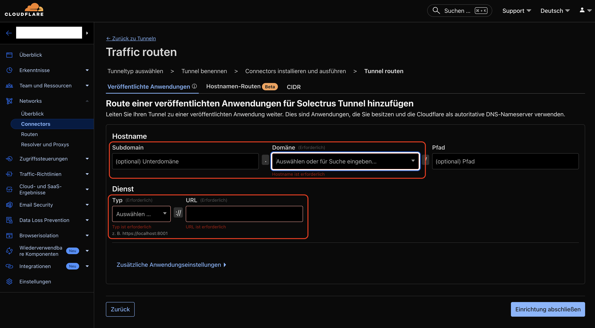

## Anpassungen auf dem SOLECTRUS Server / Docker-Stack

### Docker Compose YAML und .env Datei

Wenn man die Token Variable gern in der .env Datei pflegen möchte kann man, muss  token" auch durch `${CLOUDFLARE_TUNNEL_TOKEN}` ersetzen und dann in der `.env` Datei folgendes hinzufügen, wenn man die Variablen an einer Stelle haben möchte:

Anpassung `.env` Datei:
```
##################################################################
###                     Cloudflare tunnel                      ###
##################################################################

# Cloudflare tunnel token
CLOUDFLARE_TUNNEL_TOKEN=<token>
```
> `<token>` muss durch das Cloudflare Tunnel Token ersetzt werden.

Anpassung `compose.yml` (oder `docker-compose.yml`):
```
  tunnel:
    container_name: cloudflared-tunnel
    image: cloudflare/cloudflared
    restart: unless-stopped
    command: tunnel run
    environment:
      - TUNNEL_TOKEN=${CLOUDFLARE_TUNNEL_TOKEN}
    labels:
      - com.centurylinklabs.watchtower.scope=solectrus
```

> Unbedingt darauf achten, dass richtig eingerückt wird!
> 
> Alternativ kann hier auch direkt `${CLOUDFLARE_TUNNEL_TOKEN}` durch das Cloudflare Tunnel Token `<token>` ersetzt werden, wenn man die `.env` Datei nicht zusätzlich anzupassen möchte.

### Neustart des Docker-Stacks

Damit das Cloudflare Docker Image geladen und gestartet wird, muss der SOLECTRUS Docker-Stack einmal neu gestartet werden:

`docker compose down && docker compose up -d`

Falls auf dem Server keine Updates von Docker und Docker Compose durchgeführt wurden, muss der ältere Befehl genutzt werden:

`docker-compose down && docker-compose up -d`

Es dauert etwas, bis alle Container laufen und die Weboberfläche abrufbar ist.

Laufen alle Docker-Container schon? Kann einfach mit `docker compose ps` nachgeprüft werden.

### (Sub-)Domain testen

In Cloudflare sollte der Tunnel nun im Status <b>FEHLERFREI</b> (grün) stehen.

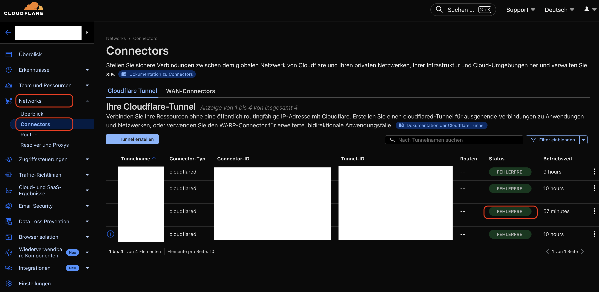

Durch den Aufruf der (Sub-)Domain, also bspw. `https://strombilanz.domain.de` kann geprüft werden, ob der Tunnel funktioniert.

Wenn die folgende Fehlermeldung erscheint, ist etwas nicht korrekt in Cloudflare eingerichtet. Am besten die Punkte 8-11 noch einmal genauer anschauen.

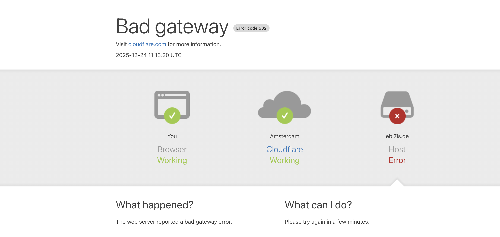

## Optional: Tunnel absichern

Die SOLECTRUS Strombilanz Dashboard ist jetzt über die (Sub-)Domain über das Internet erreichbar. Ggf. soll der Zugriff begrenzt werden.

> Die Verbindung sollte vorher einmal geprüft werden, um sicher zu gehen, dass der Tunnel auch steht.

### Richtlinie(n) anlegen

1. Im Menü <b>Zugriffssteuerungen -> Richtlinien</b> anwählen
2. Mit dem Button "<b>+ Richtlinie hinzufügen</b>" klicken.

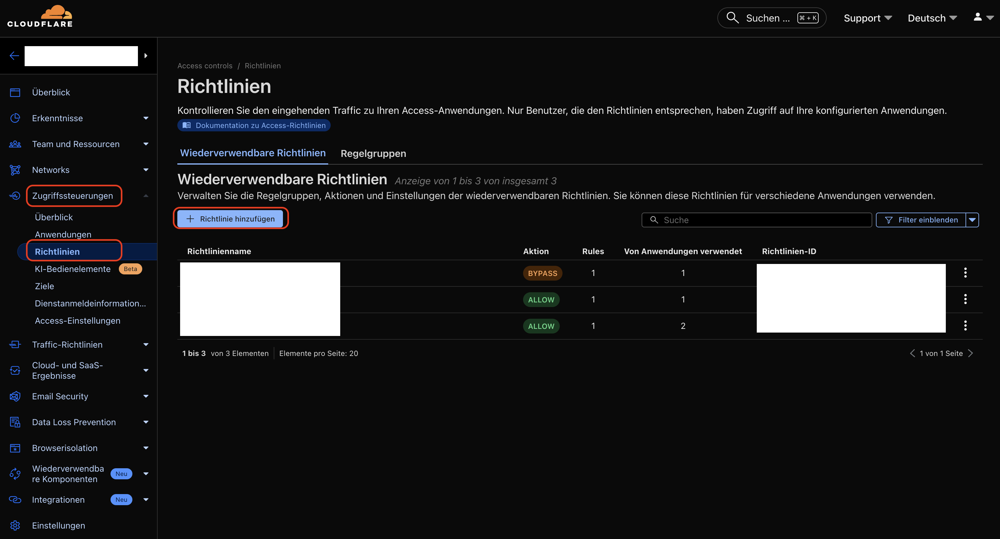

Es kann eine oder mehrere Regeln angelegt werden.

Beispiel: E-Mail Adresse als 2. Faktor

3. Sprechenden Namen vergeben, bspw. `SOLECTRUS E-Mail erlauben`
4. Aktion auswählen "<b>Allow</b>"
5. Regel hinzufügen "<b>Emails</b>"
6. Bei Wert eine E-Mail Adresse hinzufügen, die erlaubt sein soll
7. Mit der Schaltfläche <b>Speichern</b> den Dialog beenden

> Es ist möglich mehrere Regeln in einer Richtlinien anzulegen.


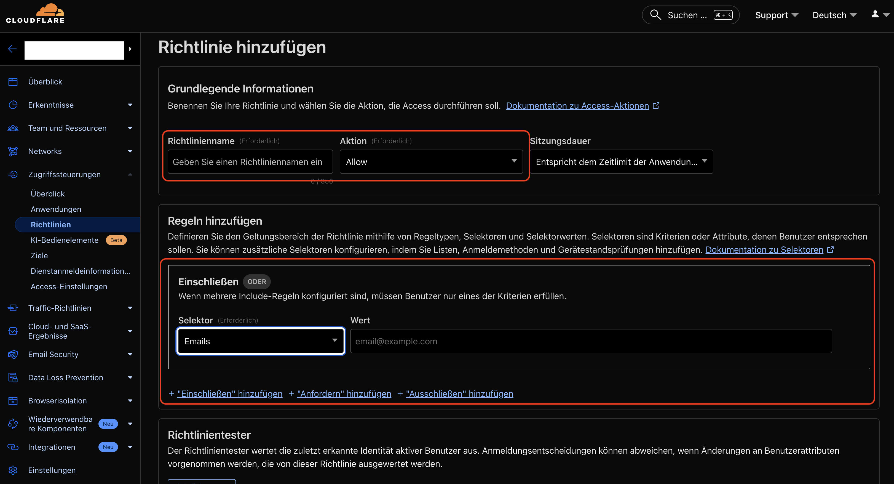

### Anwendung einrichten

1. Im Menü <b>Zugriffssteuerungen -> Anwendungen</b> anwählen
2. Mit dem Button "<b>+ Anwendung hinzufügen</b>" klicken.

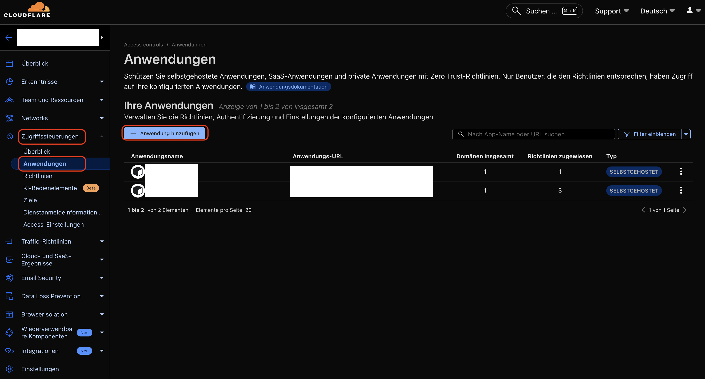

1. Selbstgehostet anwählen

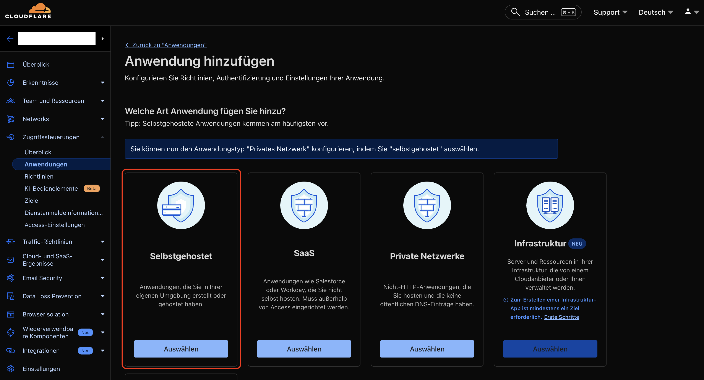

2. Sprechenden Namen vergeben, bspw. `SOLECTRUS Web`
3. Schaltfläche anwählen "<b>+ Öffentlichen Hostnamen hinzufügen</b>" anwählen
4. Gleiche Subdomain wie beim Tunnel eintragen
5. Gleiche Domäne wie beim Tunnel eintragen
6. Pfad leer lassen
7. Bei <b>Zugriffsrichtlinien</b> die erstellte oder mehrere Richtlinien hinzufügen
8. Mit der Schaltfläche <b>Anwendung speichern</b> den Dialog beenden

> Es ist möglich mehrere Richtlinien (mit deren Regeln) in Kombination zu hinterlegen.

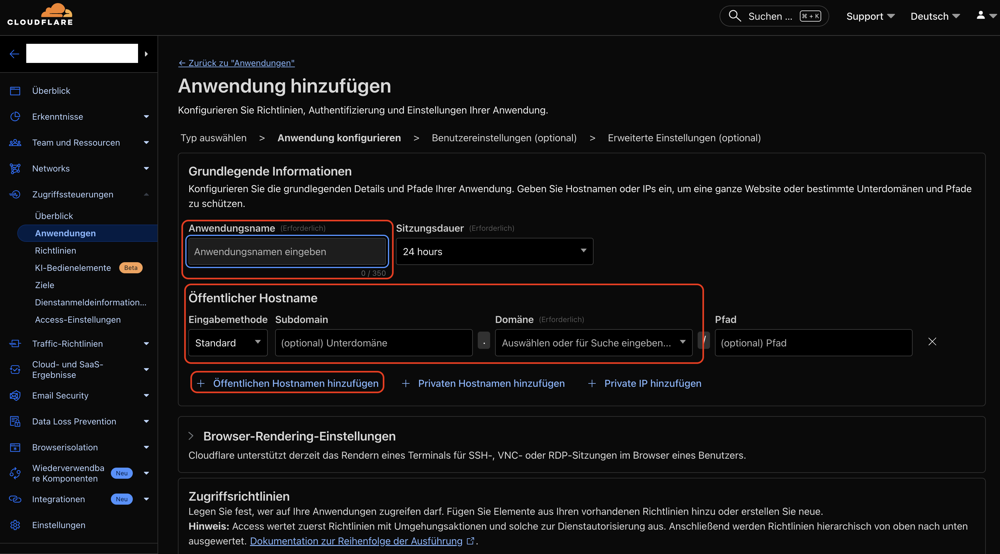

### Anwendung und Richtlinie prüfen

Durch den Aufruf der (Sub-)Domain, also bspw. `https://strombilanz.domain.de` kann geprüft werden, ob der Tunnel nun auch gesichert ist.

Zunächst muss die hinterlegte E-Mail Adresse beim Dialog eingegeben werden.

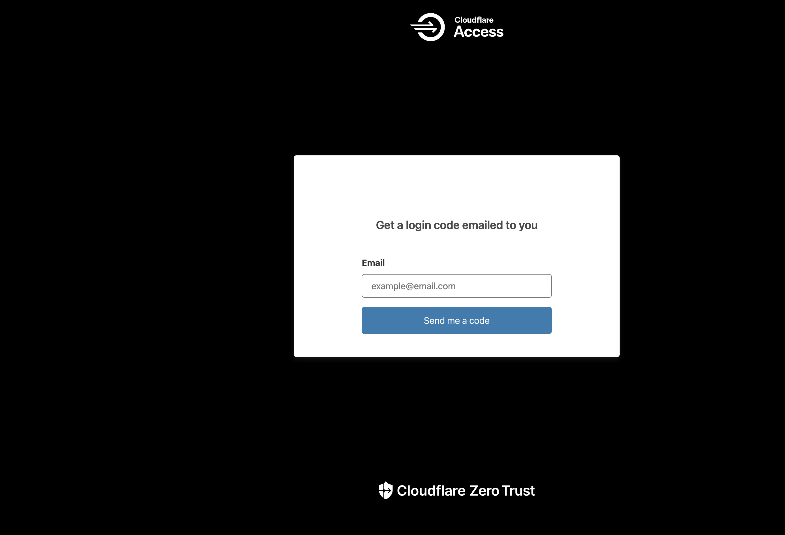

Auf die E-Mail Adresse sendet Cloudflare einen Code. Dieser muss nun im 2. Dialog eingegeben werden.

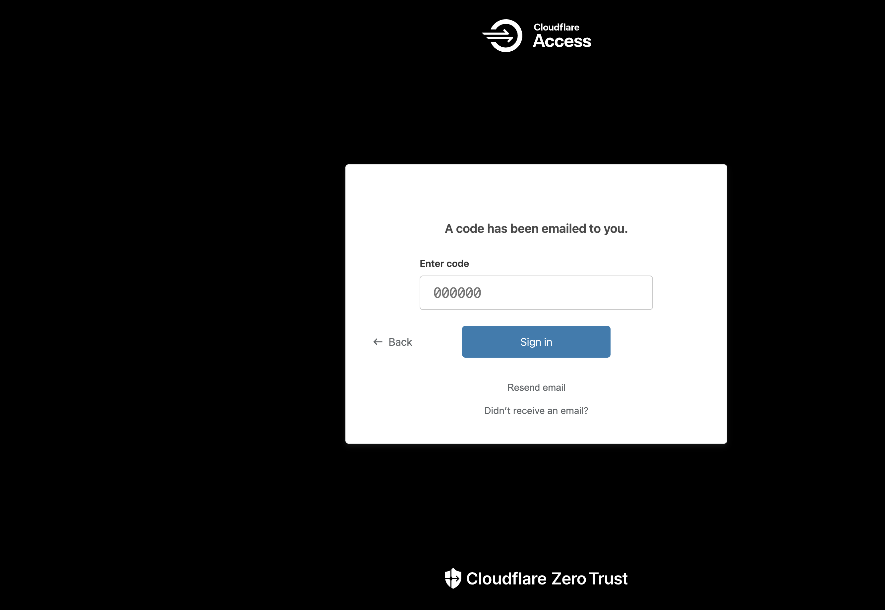

Der lokal gehostete Dienst wird angezeigt.
